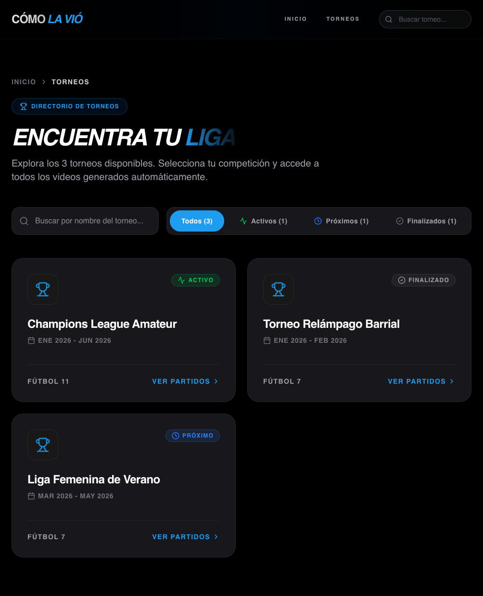
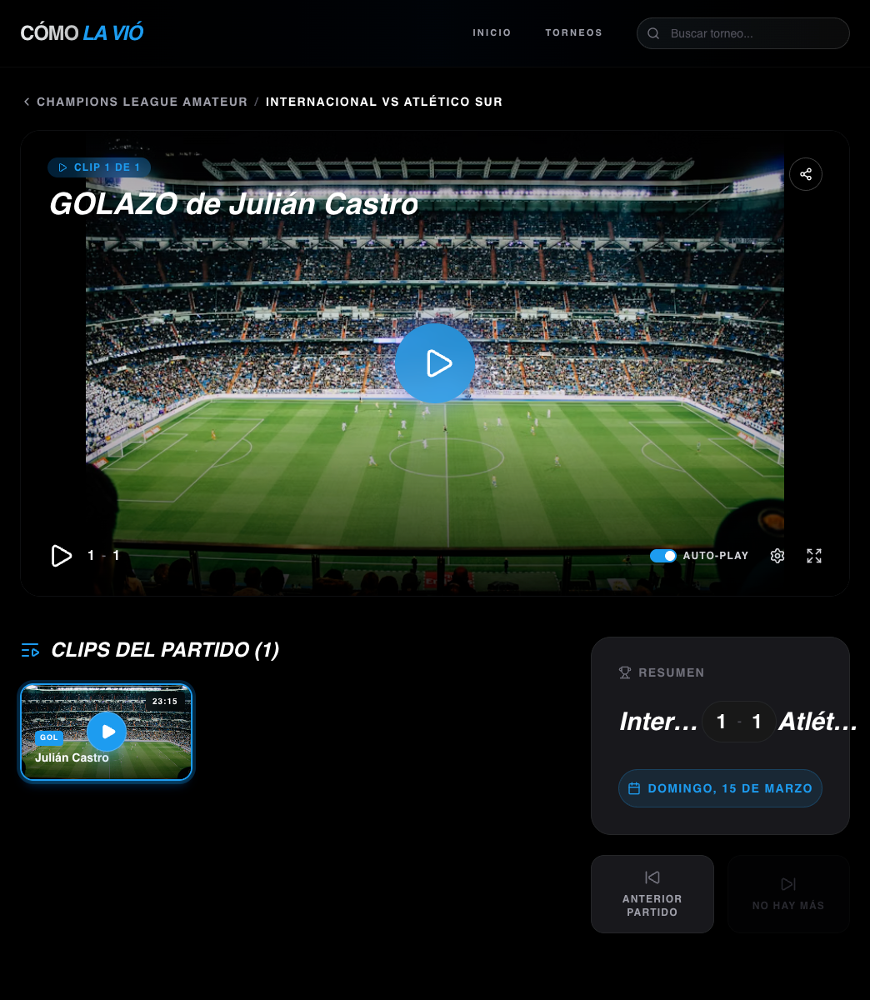

<!-- ===================================================== -->
<!-- ====================== HEADER ======================= -->
<!-- ===================================================== -->

<h1 align="center">⚽ Cómo La Vió — AI Sports Highlights</h1>

  Plataforma de highlights deportivos impulsada por automatización y detección de eventos.

  <strong>Revive cada gol. Cada atajada. Cada momento clave.</strong>

  
  
  
  

---

## 🚀 Sobre el Proyecto

**Cómo La Vió** es una plataforma que permite registrar automáticamente los momentos más importantes de un partido y generar clips de highlights pocos minutos después de finalizar el encuentro.

En lugar de editar manualmente partidos completos, el sistema:

- Detecta goles, atajadas, oportunidades y jugadas clave.
- Genera aproximadamente 20 clips por partido.
- Produce videos cortos de 22 segundos.
- Publica el contenido minutos después de finalizar el juego.
- Organiza todo por torneo y fecha.

Sin edición manual.  
Sin tiempos de espera largos.  
Solo los mejores momentos.

---

## 🧠 Visión de Producto

Muchos torneos amateur y semiprofesionales no cuentan con sistemas estructurados de highlights.

Esta plataforma busca:

- Democratizar el acceso a momentos destacados.
- Aumentar la interacción con torneos.
- Facilitar la repetición ilimitada de jugadas.
- Organizar contenido por fecha y competencia.
- Ofrecer narración opcional profesional.

El objetivo es amplificar la emoción del deporte mediante automatización inteligente.

[Ver el proyecto en vivo acá]( https://como-la-vio.vercel.app/)

## Home

  

## Torneos

  

## Partidos

  

